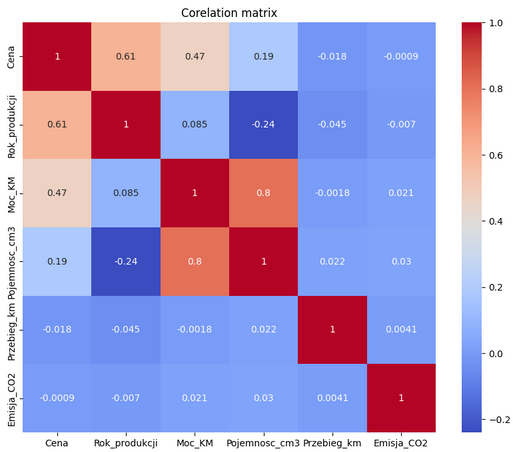
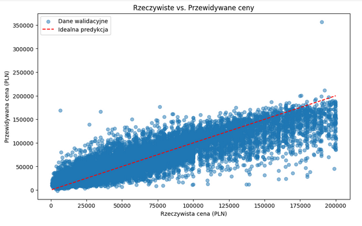

# 🚗 Car Price Prediction – Kaggle Competition

## Project Overview

This project aims to build a predictive model capable of accurately estimating car prices based on detailed listings scraped from a popular classified ads website. The dataset includes extensive vehicle information such as brand, model, production year, mileage, fuel type, and equipment features.

📂 The dataset consists of the following files:

- `sales_ads_train.csv` – Original training data with vehicle prices.
- `synthetic_training_data_sdv_pl.csv` – Synthetic data generated using the SDV framework.
- `synthetic_training_data_mostlyai_pl.csv` – Synthetic data generated using the MostlyAI platform.
- `sales_ads_test.csv` – Test data without prices, used for model evaluation.

## Project Tasks
- **Kanban Board Setup**: We created a Trello Kanban board to better plan and organize our work and meetings. You can check it out [here](https://trello.com/invite/b/620fae21ccd3a2069341f4c8/ATTI41ea914ac589065d62e4ac78452d981eC28D9F9D/ds-club-zadanie-rekrutacyjne).
- **Exploratory Data Analysis (EDA)**: We conducted an in-depth analysis of both numerical and categorical features to understand distributions, identify outliers, and assess missing values. The EDA helped us uncover key patterns and relationships influencing car prices.
- **Data Preprocessing and Feature Engineering**: We cleaned and preprocessed the dataset by handling missing values, transforming variables (e.g., converting complex features like equipment lists into usable formats), and filling most missing values based on the most frequent values observed in brand:model pairs.
- **Model Training and Tuning**: We initially conducted traditional regression analysis, followed by neural network modeling using Keras. Our final predictive model was built using AutoGluon to automatically optimize performance and effectively capture the factors driving car prices.
- **Kaggle Competition Submission**: We prepared and submitted our predictions for evaluation on Kaggle, incorporating cross-validation and ensemble strategies to improve accuracy.

  
  

## Technologies and Libraries

The project utilizes the following Python libraries:
- **Jupyter Notebook** – interactive development and documentation environment
- **NumPy** – numerical computations and array operations
- **Pandas** – data manipulation and analysis
- **Scikit-learn** – Data preprocessing and modeling
- **Seaborn** – Visualization and exploratory analysis
- **Matplotlib** – comprehensive library for creating static, animated, and interactive visualizations
- **AutoGluon** – automated machine learning toolkit for rapidly building accurate models

## Evaluation Metrics

Model performance was evaluated using the following metrics:
- **R-squared (R²)** – to measure the proportion of variance in the car prices explained by our model.
- **Root Mean Squared Error (RMSE)** – the primary evaluation metric on Kaggle, assessing the average prediction error in the same units as the target variable.

## Challenges

**Skewed Price Distribution**  
   - **Challenge:** The price variable exhibited a long right tail, complicating model performance and interpretation.  
   - **Solution:** We analyzed percentiles and tried to apply transformations (such as logarithmic scaling) to stabilize the distribution.

**Missing Values**  
   - **Challenge:** Some columns had a great number of missing values, complicating robust analysis.  
   - **Solution:** We filled most missing values using the most frequent values observed in brand:model pairs, and applied imputation techniques for the remainder.

**Team ML Expertise Discrepancy**  
  - **Challenge:** Initially, there was a significant disparity in machine learning expertise among team members, which raised concerns about potential delays in developing and fine-tuning our models.  
  - **Solution:** We strategically allocated tasks so that one member could focus on upskilling in ML while the other one advanced components of the project. Through continuous collaboration and effective task delegation, we turned this challenge into an opportunity, ultimately ensuring a balanced workflow and successful model integration.

**Model Optimization**  
   - **Challenge:** Choosing the best predictive model among traditional regression, neural networks, and automated machine learning.  
   - **Solution:** We began with regression analysis, experimented with neural networks using Keras, and ultimately employed AutoGluon to automatically optimize model performance.
